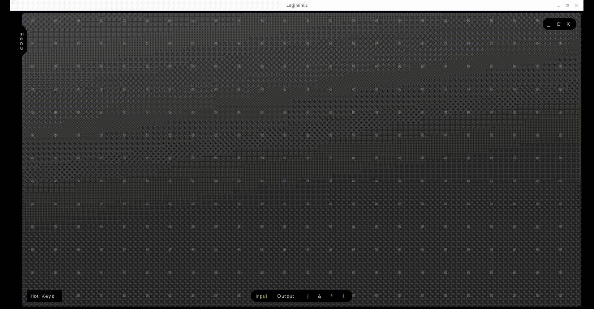
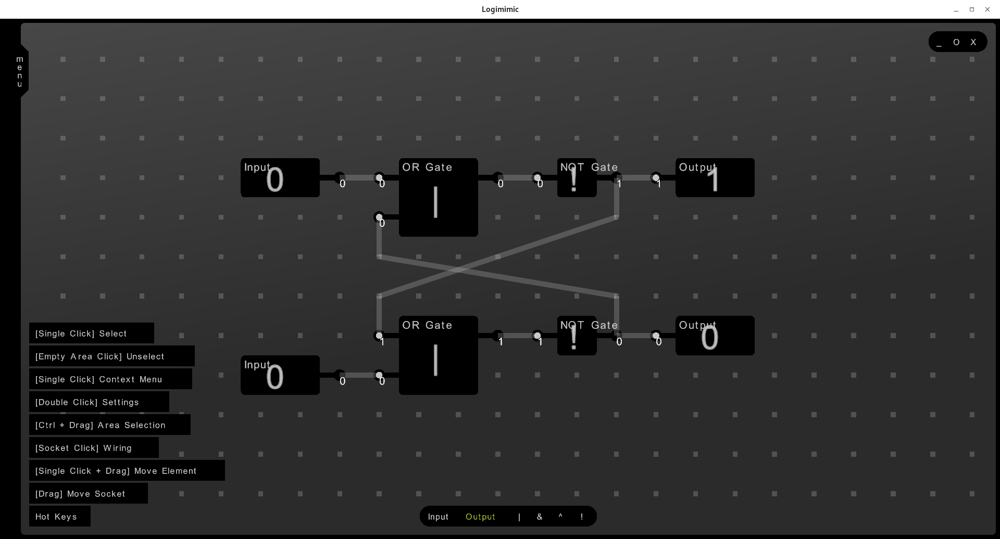

# Logimimic

Logimimic is a modern cross-platform application for designing and simulating digital logic circuits.

This project has two main goals:

- make an easy to use circuit design application

- show capabilities of my new GUI library

Note that it is not production ready, it rather the dirty draft and proof of concept of the gui library.

## Demo
  

## Screenshots

## Usage

The main panel is a `dock panel` located at the bottom center.

Select an element and click on the `grid` to place them.

To move element press on them till it highlights green and then drag. When you click on element you can spot the `hud panel`.

The `hud panel` allows you to use context menu to manipulate an element. `Hud panel` avalible for all entities on the grid including `wires`.

To connect elements click on the output socket once and then click to another input socket.

To move element's socket just drag them.

## Building and installation

Currently the project is under heavy refactoring and it is not possible to build it. The framework `Crovown` used in this project is in development stage too and it is frequently updating, so I will change this notes when everythig be ready. Hovewer you can download development build in the `Releases` section.

For Windows use `html5` version
The latest version avalible just for `Linux`

## Community

Join our [Discord server](https://discord.gg/duDwM6PjGk)!
