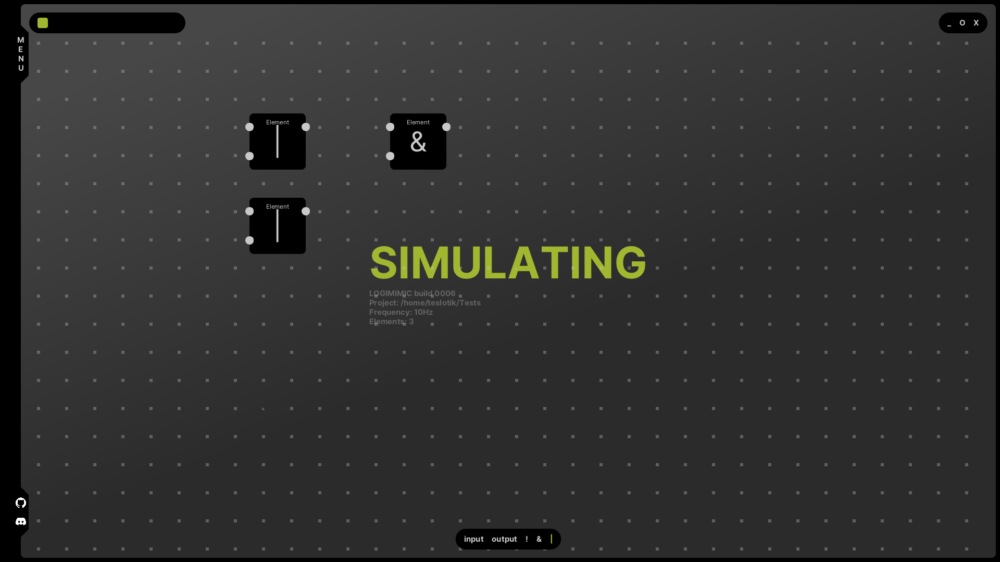

# Logimimic

Logimimic is a modern cross-platform application for designing and simulating digital logic circuits

This project has two main goals:

- make an easy to use circuit design application

- show capabilities of my new UI library
  
  ## Demo
  
  

## Community

Join our [Discord server](https://discord.gg/8ccsME7T)!

